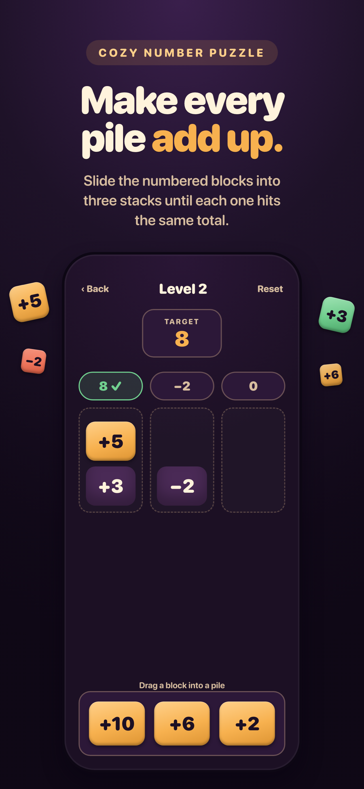
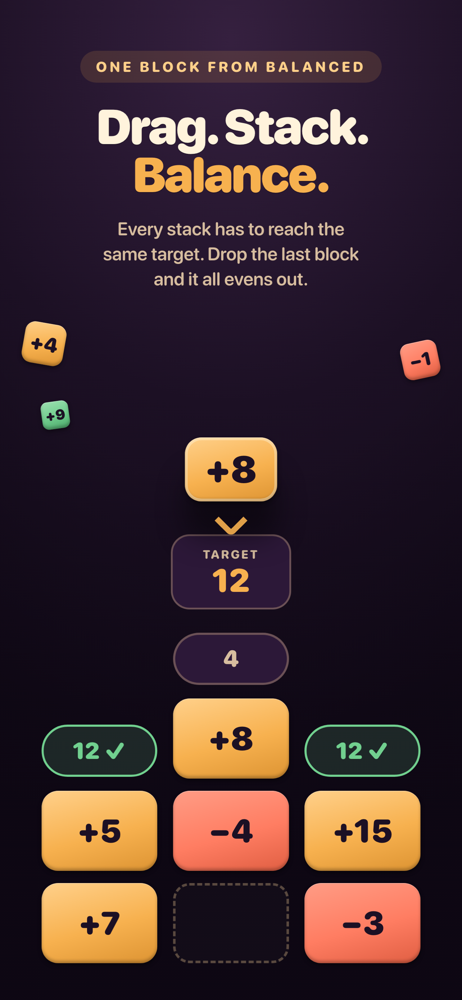
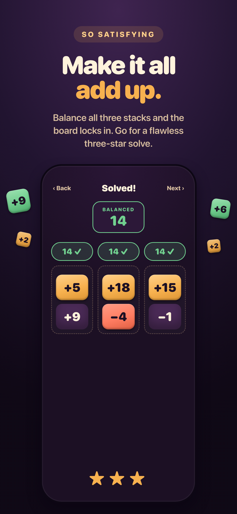

# Sum Stacker

A minimalist number puzzle for iOS and Android. Drag number blocks onto three piles until every pile adds up to the same total.

Built with Expo (SDK 57) and React Native.

<p align="center">
  
  
  
</p>

## How the game works

Every level gives you three piles and a tray of number blocks — positive and negative. Drag each block from the tray onto a pile. You win when the tray is empty **and** all three piles hold the same sum.

- **Hint blocks** start pre-placed in a pile and can't be moved. Easier levels have more of them.
- **The target sum** is shown on easy and medium levels, and hidden on hard ones — there you have to work out the balance point yourself.
- **Stars** are scored on move efficiency: 3 stars for a perfect run (one move per block), 2 stars within 1.5× that, 1 star otherwise.
- **Progress** unlocks sequentially — clearing a level opens the next one. Best stars and best move count are saved per level.

There are **100 hand-authored levels** (35 easy, 49 medium, 16 hard). Difficulty ebbs rather than climbing straight up: a hard spike lands roughly every sixth level, each followed by an easier breather.

## Getting started

```bash
npm install
npm start        # Expo dev server
npm run ios      # build and run on iOS
npm run android  # build and run on Android
npm test         # Jest unit tests
```

`npm run ios` / `npm run android` do a native build, so they need Xcode or Android Studio set up. `npm start` alone is enough for JS-only changes against an existing dev build.

## Project layout

```
src/
  game/        level definitions, types, and the game-state reducer
  screens/     Home, LevelSelect, LevelBoard, Credits
  components/  NumberBlock, Pile, Footer, StarRating, modals
  storage/     AsyncStorage wrappers for progress and settings
  audio/       sound effects, background music, haptics
  theme/       color tokens and shared styles
  navigation/  React Navigation native stack
```

A few notes on how it fits together:

- **Levels are authored, not generated.** [levels.ts](src/game/levels.ts) declares each level as three pile blueprints; `buildLevel` derives the target sum from the first pile and **throws at import time** if any pile disagrees — a typo in a level fails fast rather than shipping an unsolvable puzzle. It also interleaves tray blocks round-robin across piles so their order doesn't give the answer away.
- **Game state is a pure reducer.** [useGameState.ts](src/game/useGameState.ts) owns block positions, move count, pile sums, win detection, and star rating. It has no knowledge of rendering, which is what makes it directly unit-testable.
- **Drag and drop** uses `react-native-gesture-handler` with `react-native-reanimated`; piles report their measured rects and a drop is resolved by hit-testing the release point.
- **Persistence** is AsyncStorage only — no accounts, no backend, no network calls. Progress lives under `@number-puzzle/progress/v1`, settings under `@number-puzzle/settings/v1`, both versioned so a future migration has something to key off.

## Tests

```bash
npm test
```

Jest with the `jest-expo` preset. Coverage is on the logic layer — level integrity, the state reducer, and progress storage — rather than on rendering.

## Building for release

EAS build profiles are configured in [eas.json](eas.json):

```bash
eas build --profile development --platform ios   # dev client, internal
eas build --profile preview --platform ios       # internal distribution
eas build --profile production --platform ios    # store build, auto-increments version
```

## Credits

Background music: **"Paint the Skies"** by 12am, from [Uppbeat](https://uppbeat.io/t/paint-the-skies/12am) (license code `3L8L0IO4TJ9UVO1Y`). Also shown in-app on the Credits screen.

## License

MIT — see [LICENSE](LICENSE).
